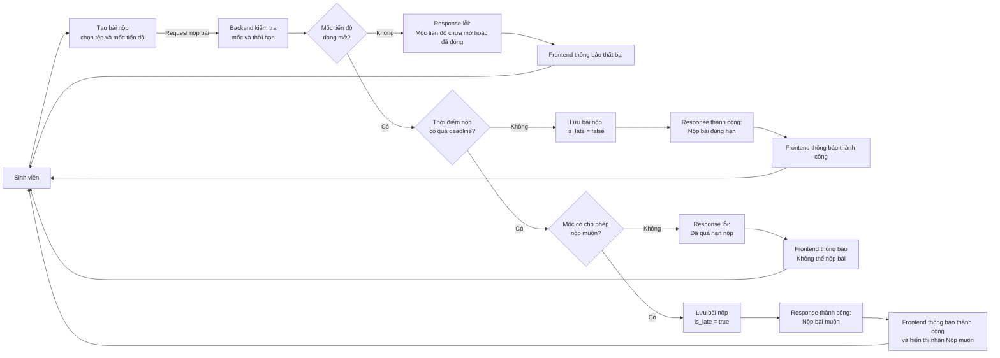

# Luồng sinh viên nộp tiến độ

Sơ đồ ngắn gọn cho nghiệp vụ nộp tiến độ, tập trung vào thời hạn nộp.

| Trường hợp | Response từ backend | Dữ liệu lưu trong DB |
|---|---|---|
| Mốc chưa mở/đã đóng | Lỗi: không được nộp bài | Không lưu dữ liệu |
| Nộp trước hoặc đúng deadline | Thành công: nộp đúng hạn | `is_late = false`, `status = SUBMITTED` |
| Nộp sau deadline, không cho phép muộn | Lỗi: đã quá hạn nộp | Không lưu dữ liệu |
| Nộp sau deadline, cho phép muộn | Thành công: nộp muộn | `is_late = true`, `status = SUBMITTED` |
