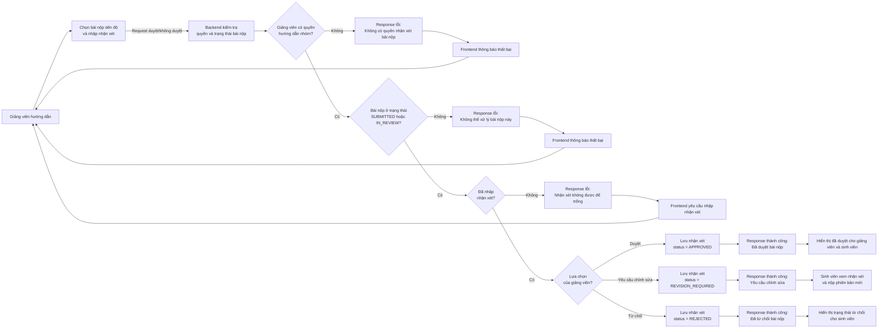

# Luồng giảng viên hướng dẫn nhận xét tiến độ

Sơ đồ nghiệp vụ khi giảng viên hướng dẫn xem, nhận xét và duyệt hoặc không duyệt bài nộp tiến độ của sinh viên.

| Lựa chọn của giảng viên | Response từ backend | Trạng thái bài nộp | Kết quả với sinh viên |
|---|---|---|---|
| Duyệt | Thành công: đã duyệt bài nộp | `APPROVED` | Bài nộp được chấp nhận, không được nộp phiên bản thay thế. |
| Yêu cầu chỉnh sửa | Thành công: yêu cầu chỉnh sửa | `REVISION_REQUIRED` | Xem nhận xét và nộp phiên bản mới. |
| Từ chối | Thành công: đã từ chối bài nộp | `REJECTED` | Xem lý do từ chối; có thể nộp lại nếu mốc vẫn cho phép nộp. |
